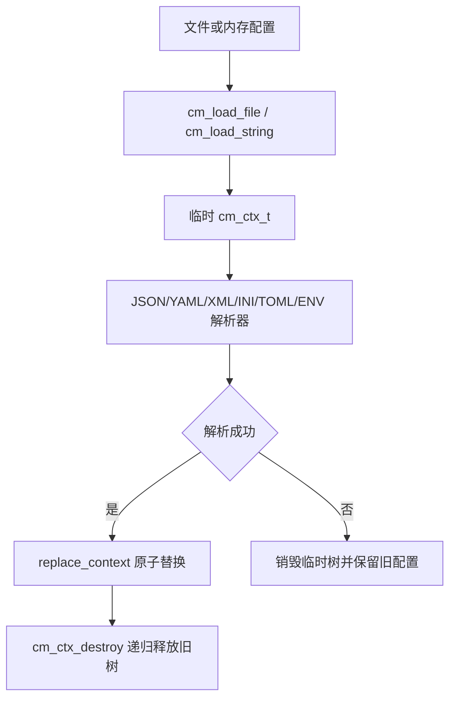
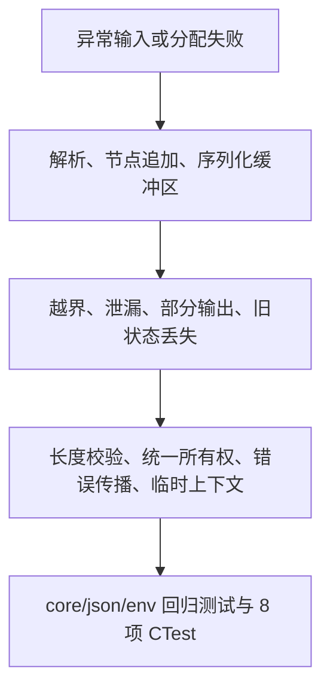

# config_manager Bug 与内存泄漏审查报告

审查日期：2026-07-14  
审查范围：`include/`、`src/`、`tests/`、`CMakeLists.txt`  
审查方式：以静态代码审查为主，结合 MSVC Release 构建、CTest、失败路径与所有权分析。审查中发现的问题已按用户要求修复并补充回归测试。

## 1. 审查结论摘要

本次确认了一个可由空白 properties 行触发的越界读取，以及多处失败路径所有权、部分写入、上下文破坏和测试假绿问题。最高风险位于 properties 解析和嵌套键写入：前者会读取缓冲区起点之前的字节，后者在标量父节点下继续创建子节点时可能产生脱离树结构的分配对象。

修复后，加载操作改为临时上下文解析并在成功后原子替换；核心节点构造、追加、合并和序列化均传播分配失败；文件读写验证完整长度；Release 测试强制保留断言。当前 8 个 CTest 测试全部通过，未保留已确认的 Critical/High 未解决项。

### 1.1 风险总览

| 排名 | ID | 严重程度 | 类别 | 主要位置 | 摘要 | 是否解决 |
| --- | --- | --- | --- | --- | --- | --- |
| 1 | R01 | 🟠 High | 越界读取 | `src/cm_env.c:255` | 空白 properties 行会访问 `p[-1]` | 🟢 已解决 |
| 2 | R02 | 🟠 High | 所有权/结构损坏 | `src/cm_core.c:347` | 标量父节点下写入深层键会产生脱离树节点 | 🟢 已解决 |
| 3 | R03 | 🟡 Medium | 内存泄漏 | `src/cm_core.c:347` | setter、数组追加和深拷贝失败时对象未统一释放 | 🟢 已解决 |
| 4 | R04 | 🟡 Medium | 状态一致性 | `src/cm_dispatch.c:77` | 解析失败会清空调用方原有配置 | 🟢 已解决 |
| 5 | R05 | 🟡 Medium | 文件完整性 | `src/cm_dispatch.c:12` | `ftell/fread/fwrite` 结果未验证 | 🟢 已解决 |
| 6 | R06 | 🟢 Low | 空指针 | `src/cm_core.c:441` | getter 未校验输出指针 | 🟢 已解决 |
| 7 | R07 | 🟢 Low | 测试可靠性 | `tests/CMakeLists.txt:24` | Release 下 `assert` 被禁用造成假绿 | 🟢 已解决 |
| 8 | R08 | 🔵 Info | 生命周期 | `src/cm_core.c:104` | 节点树具有递归释放路径，成功路径所有权清晰 | ⚪ 不适用 |

### 1.2 严重程度定义

| 灯号 | 严重程度 | Meaning |
| --- | --- | --- |
| 🔴 | Critical | 远程未认证触发、内存破坏、进程级内存 DoS 或最高优先级可用性问题 |
| 🟠 | High | 现实输入可触发越界、泄漏、资源耗尽或严重稳定性问题 |
| 🟡 | Medium | 依赖特定失败条件，但会影响安全、可靠性或数据一致性 |
| 🟢 | Low | 健壮性、兼容性、诊断或低影响正确性问题 |
| 🔵 | Info | 正向生命周期观察或无需代码修复的验证项 |

### 1.3 解决状态图例

| 图标 | 状态 | 说明 |
| --- | --- | --- |
| 🔴 | 未解决 | 已确认风险且尚未实现修复 |
| 🟡 | 处理中 / 部分解决 | 已有缓解但验证不完整 |
| 🟢 | 已解决 | 修复已实现并通过对应测试 |
| ⚪ | 不适用 | 信息项或无需代码修复 |

## 2. 数据与内存流转图

### 2.1 配置加载生命周期

### 2.2 风险与修复关系

### 2.3 节点所有权示意

<svg width="980" height="260" viewBox="0 0 980 260" xmlns="http://www.w3.org/2000/svg" role="img" aria-label="config manager node ownership lifecycle">
  <rect x="30" y="70" width="170" height="80" rx="12" fill="#dbeafe" stroke="#2563eb"/>
  <text x="115" y="105" text-anchor="middle" font-size="18">cm_ctx_t</text>
  <text x="115" y="132" text-anchor="middle" font-size="14">唯一持有 root</text>
  <path d="M200 110 H300" stroke="#334155" stroke-width="3" marker-end="url(#arrow)"/>
  <rect x="300" y="50" width="190" height="120" rx="12" fill="#dcfce7" stroke="#16a34a"/>
  <text x="395" y="100" text-anchor="middle" font-size="18">对象/数组节点</text>
  <text x="395" y="130" text-anchor="middle" font-size="14">持有全部子节点</text>
  <path d="M490 110 H600" stroke="#334155" stroke-width="3" marker-end="url(#arrow)"/>
  <rect x="600" y="50" width="170" height="120" rx="12" fill="#fef3c7" stroke="#d97706"/>
  <text x="685" y="100" text-anchor="middle" font-size="18">叶节点</text>
  <text x="685" y="130" text-anchor="middle" font-size="14">字符串独立分配</text>
  <path d="M770 110 H875" stroke="#334155" stroke-width="3" marker-end="url(#arrow)"/>
  <rect x="875" y="75" width="80" height="70" rx="12" fill="#fee2e2" stroke="#dc2626"/>
  <text x="915" y="116" text-anchor="middle" font-size="17">free</text>
  <defs><marker id="arrow" markerWidth="10" markerHeight="10" refX="8" refY="3" orient="auto"><path d="M0,0 L0,6 L9,3 z" fill="#334155"/></marker></defs>
</svg>

## 3. 详细问题清单

### R01 [🟠 High] properties 空白行越界读取

**位置**
- `src/cm_env.c:255` `parse_properties_data`

**触发条件**

输入包含空白行或仅空格的行，并且后面仍有内容时，旧实现直接读取 `p[strlen(p)-1]`。

**影响**

读取缓冲区起点之前的内存，可能导致崩溃或未定义行为。

**证据与路径**

`ltrim` 返回空字符串，`strlen` 为零，旧下标转换为 `-1`。修复后先缓存长度并要求 `line_length > 0`。

**修复建议**

已实现长度前置检查，并避免无界负向索引。

**验证建议**

`tests/test_env.c:211` 覆盖空行、空格行与后续有效键。

### R02 [🟠 High] 深层写入可能产生脱离树节点

**位置**
- `src/cm_core.c:347` `set_node`

**触发条件**

先写入 `parent=scalar`，随后写入 `parent.child.value`。

**影响**

旧实现忽略 `cm_node_object_add` 的类型错误，可能继续构造无法由根节点释放的子树。

**证据与路径**

修复后 `ensure_path` 强制每一级为对象，并传播追加失败；`set_node` 对失败节点统一释放。

**修复建议**

已实施父类型校验和所有权收口。

**验证建议**

`tests/test_core.c:213` 验证返回 `CM_ERR_TYPE_MISMATCH` 且不创建子路径。

### R03 [🟡 Medium] 分配失败路径所有权不一致

**位置**
- `src/cm_core.c:33` 节点构造
- `src/cm_core.c:124` 对象/数组扩容
- `src/cm_core.c:588` 数组追加

**触发条件**

键复制、字符串复制、容器扩容或深拷贝发生内存分配失败。

**影响**

可能泄漏新节点、返回部分深拷贝或错误地标记配置已修改。

**证据与路径**

所有构造器现在检查子分配；容量增长检查整数溢出；追加失败释放未接管节点；合并失败向调用方返回错误。

**修复建议**

已统一为“成功后父节点接管，失败前创建者释放”。

**验证建议**

建议在 Linux CI 增加分配失败注入与 ASan/LSan 测试。

### R04 [🟡 Medium] 解析失败破坏原有配置

**位置**
- `src/cm_dispatch.c:77` `replace_context`

**触发条件**

已加载有效配置后再次加载语法错误内容。

**影响**

旧实现会先清空上下文，导致调用方失去最后一份有效配置。

**证据与路径**

顶层加载现使用临时上下文，仅在解析成功后替换目标树。

**修复建议**

已实现事务式加载。

**验证建议**

`tests/test_json.c:51` 验证解析失败后旧值仍可读取。

### R05 [🟡 Medium] 文件读写结果未完整验证

**位置**
- `src/cm_dispatch.c:12` `cm_internal_read_file`
- `src/cm_dispatch.c:59` `cm_internal_write_file`

**触发条件**

不可定位文件、短读、磁盘写满、关闭刷盘失败或文件尺寸溢出。

**影响**

旧实现可能把部分文件当作完整配置解析，或把部分写入报告为成功。

**证据与路径**

统一帮助函数现在校验 `fseek/ftell/fread/fwrite/fclose`，JSON/TOML/ENV/Properties 和所有字符串保存路径复用该逻辑。

**修复建议**

已实现完整错误传播。

**验证建议**

建议 CI 增加只读目录和磁盘错误模拟测试。

### R06 [🟢 Low] getter 输出指针未校验

**位置**
- `src/cm_core.c:441` `cm_get_string` 等

**触发条件**

调用方传入空输出指针。

**影响**

空指针解引用导致崩溃。

**证据与路径**

所有 getter 和数组长度接口先返回 `CM_ERR_NULL_PTR`。

**修复建议**

已完成统一校验。

**验证建议**

`tests/test_core.c:191` 覆盖空输出指针。

### R07 [🟢 Low] Release 测试断言被编译移除

**位置**
- `tests/CMakeLists.txt:24`

**触发条件**

使用 Release 配置构建基于 `assert` 的测试。

**影响**

测试可在未执行断言的情况下报告通过。

**证据与路径**

测试目标在所有配置显式取消 `NDEBUG`，Release 构建中的断言已实际执行。

**修复建议**

已完成；后续可改为独立 CHECK 宏消除编译器重定义提示。

**验证建议**

Release CTest 8/8 通过，并确认新增失败场景会执行断言。

## 4. 内存生命周期专项分析

- `cm_ctx_t` 独占根节点，`cm_ctx_destroy` 递归释放对象、数组、键和字符串。
- `cm_node_object_add` / `cm_node_array_add` 仅在成功后转移所有权。
- `cm_load_*` 先在临时上下文构建完整树，失败时只释放临时树。
- `cm_save_string` 返回的内存仍由调用方使用 `free` 释放，接口约定未改变。
- JSON、YAML、XML、TOML 第三方解析对象均在成功和错误路径释放。

## 5. 修复优先级路线图

1. 已完成 R01、R02 的越界与所有权修复。
2. 已完成 R03-R05 的分配、状态和文件完整性加固。
3. 已完成 R06-R07 的 API 与测试可靠性修复。
4. 后续建议在 Linux CI 增加 ASan、UBSan、LSan 和分配失败注入。

## 6. 建议测试矩阵

| 维度 | Windows | Linux | macOS | Android/iOS |
| --- | --- | --- | --- | --- |
| Debug/Release 单元测试 | 已验证 Release | 建议 CI | 建议 CI | 建议交叉编译 |
| JSON/YAML/XML/INI/TOML/ENV | 8 项 CTest | 建议 ASan | 建议基础测试 | 建议禁用文件 API 时测试内存 API |
| 非法输入 | 已覆盖 JSON/properties | 建议 fuzz | 建议 fuzz | 建议 corpus smoke |
| OOM/短读/短写 | 静态验证 | 建议故障注入 | 建议故障注入 | 建议平台文件桥接测试 |

## 7. 最小验收标准

- MSVC Release 构建成功。
- `ctest --test-dir build-audit -C Release --output-on-failure` 为 8/8 通过。
- 空白 properties 行不发生越界读取。
- 解析失败保留原有配置。
- 标量父节点下深层写入返回类型错误且不泄漏脱离树节点。
- 文件短读、短写和关闭失败不报告成功。
- `git diff --check` 无错误。
